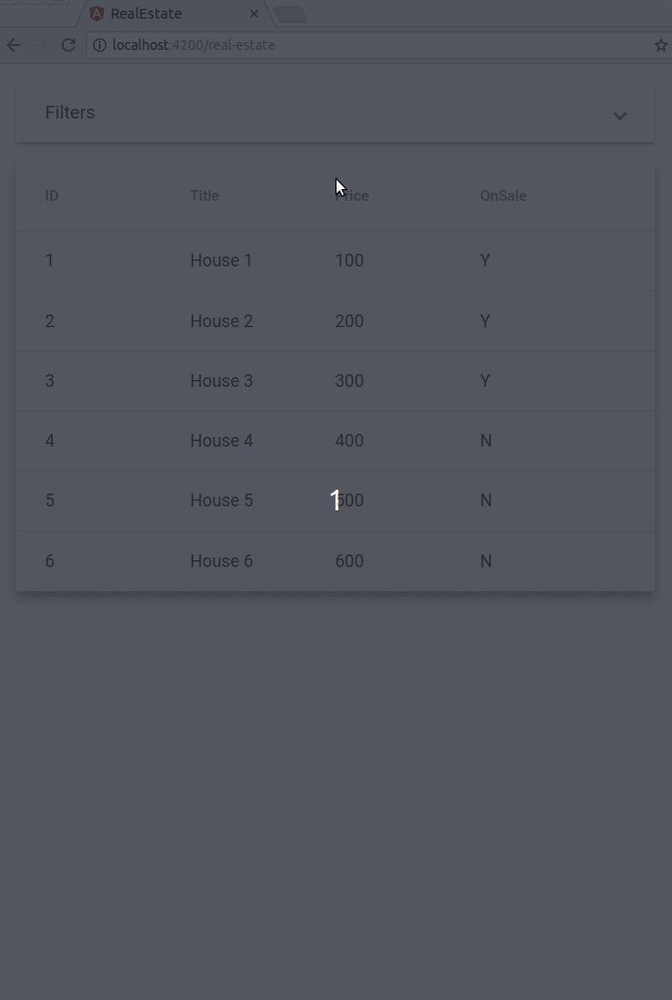

# RealEstate

## High Level Overview

You are tasked with creating a real-estate application. Users should be able to query for house offers by interacting with a filters form. Any change made to the filters form should be reflected in the URL query params. This will allow the users to bookmark the result, and come back to the filtered list at the later time. House offers should be displayed in a list under the filters form. Clicking on the house offer should take the user to the details page.

## Example

## Folder structure

### /apis

Mock apis. This section is readonly. Do not modify the source code. Have a good look at the services, because you will be asked to interact with them in the following section.

### /containers

Smart components.

You are responsible for implementing the business logic according to the comments in the source code.

### /components

Presentational components.

You are responsible for displaying the components data in the template. Any component library is allowed (Angular Material, NgBootstrap, PrimeNG, etc.).

Each component has a selection of unit tests that must be completed. Tests are intended to be shallow and usage of NO_ERRORS_SCHEMA is allowed.

### /models

Interfaces for the House, City and HouseFilters objects.

## Overview Of Application State Flow

### HouseListingComponent

Observing a change in query params should be followed by:

1.  Parsing the query params into HouseFilters object. Parsed filters should be pushed into HouseFiltersComponet [filters] @​Input.
2.  Fetching new houses list by invoking HouseService.getHouses method with the updated filters. Returned list should be pushed into HousesListComponent the [houses] @​Input.

Filters change dispatched by HouseFilters (filters) @​Output should be followed by the query params update, which will restart the query params flow (query params change -> parse filters -> fetch new list -> update filters form)

### HouseDetailsComponent

Observing a change in the params should be followed by

1.  Parsing the param object into the current id.
2.  Fetching new house by invoking HouseService.getHouse method with the current id param. Returned house should be pushed into HouseCardComponent [house] @​Input

## Checklist

1.  HouseListingComponent

- [ ] set cities$ stream
- [ ] set filters$ stream
- [ ] set houses$ stream
- [ ] implement onFiltersChange

2.  HouseDetailsComponent

- [ ] set house$ stream

3.  HouseCardComponent

- [ ] display house details in the template
- [ ] finish unit tests

4.  HouseFiltersComponent

- [ ] create filters form controls
- [ ] display filters form in the template
- [ ] finish unit tests

4.  HouseListComponent

- [ ] display house list in the template
- [ ] finish unit tests
